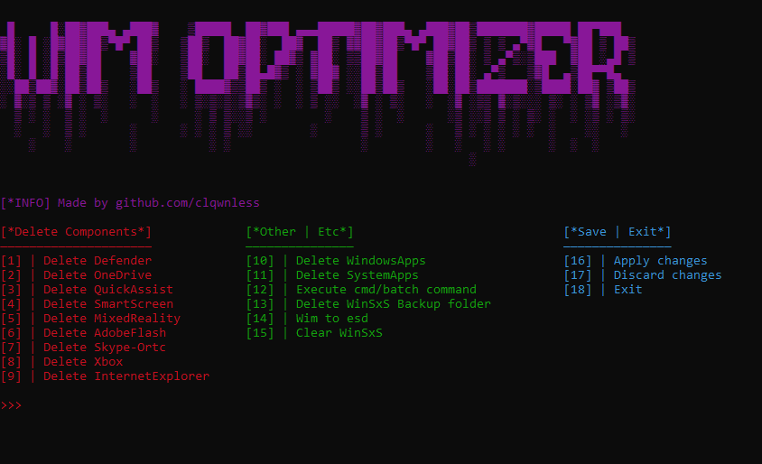

# Requirements:
dism, which added in path (by default added in path in windows 10x/windows 11x

python 3.10x

elevate python module

colorama python module

NtObjectManager powershell module

# Epilog:
first of all you need to install "NtObjectManager" module in powershell

there are two choices to install it:

first: run powershell command "Install-Module -Name NtObjectManager"

second: go to powershell dir and run install_nt_object_manager.ps1

after it install colorama module:

pip install colorama

after installing colorama, install elevate module:

pip install elevate

and finally run "main.py"

# Notes:
you need to install "NtObjectManager" powershell module as Administrator

the script runs as TrustedInstaller, so do not use unsafe commands in option 12, because you may hurm your system

# Bugs, errors:

if you found any bug/error, please create issue 

# Review:

